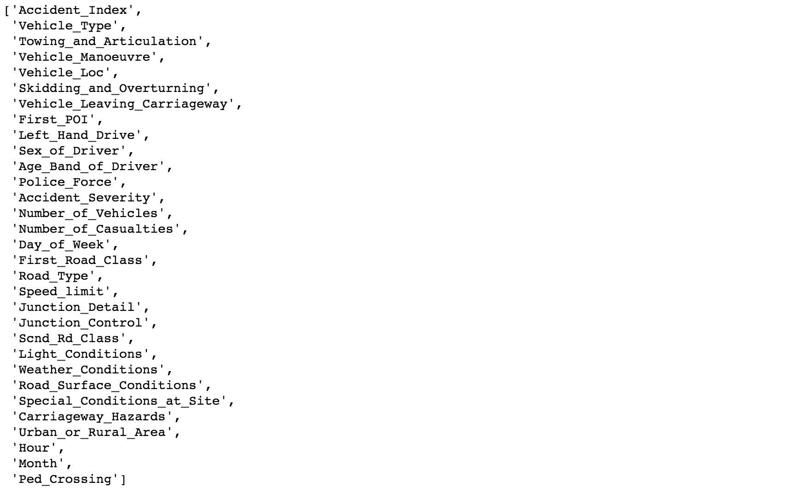
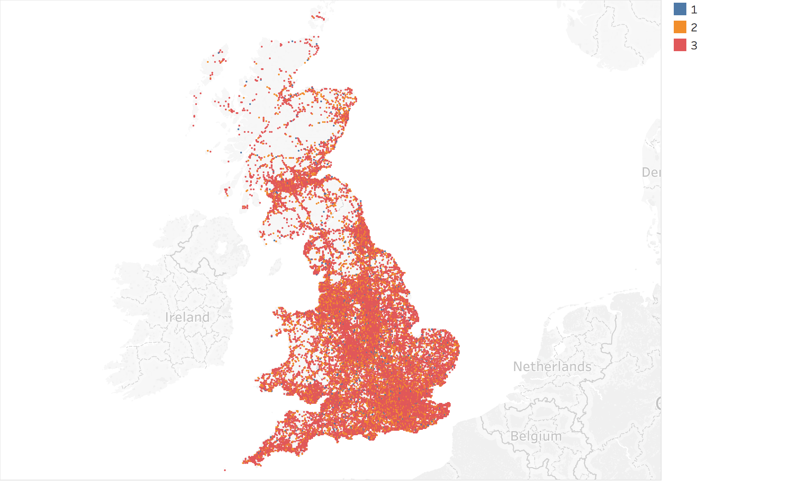
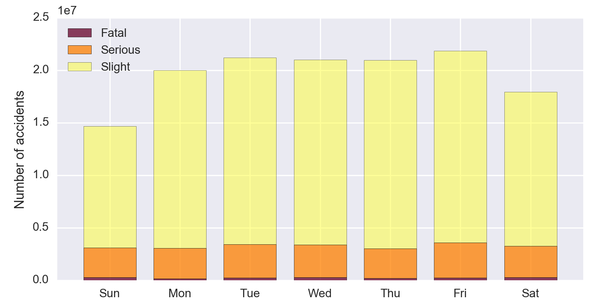

# REPORT & TECHNICAL ANALYSIS 

### Executive Summary

The goal of the project was to identify factors that influence the severity of casualties in road traffic accidents in the UK and create a classification model that, given a set of predictors, would determine said severity in future cases. 

The problem of identifying factors that influence the severity of the road traffic accidents has been researched and published before in many papers, for example [Impacts of accident severity factors and loss values of crashes on expressways in Thailand](http://www.sciencedirect.com/science/article/pii/S038611121300023X) where Multiple Logistic Regression has been used, or [Effects of Pavement Surface Conditions on Traffic Crash Severity](http://www.academia.edu/12588700/Effects_of_Pavement_Surface_Conditions_on_Traffic_Crash_Severity) where Ordered Logistic Regression has been used together with Random Forest for variable importance analysis.

This project has been based on two datasets concerning road traffic accidents which took place in 2015 in UK (excluding Northern Ireland), compiled by Department of Transport and downloaded from the [Data.gov.uk](https://data.gov.uk/dataset/road-accidents-safety-data) website. The statistics relate only to personal injury accidents on public roads that are reported to the police, and subsequently recorded, using the standard accident reporting form. The first dataset, Vehicles, listed all vehicles, that took part in accidents ending up in personal injury and contained columns related to accident circumstances and drivers demographics. Second dataset, Accidents, listed all accidents that ended up in personal injury and contained columns related to accident circumstances and location. 

We assumed that there is an association between certain features in the dataset and severity of accidents and that these features can serve as predictors in the modeling phase of the project. We also assumed that the data is as complete as possible and has been collected in fair and unbiased manner.

After conducting exploratory data analysis, creating visualisations and establishing the baseline model, 4 types of models have been tested and evaluated: Logistic Regression, k-Nearest Neighbours, Random Forest and Support Vector Machines. The models have been evaluated using accuracy scores, classification reports, confusion matrices and ROC curves.

All of the models performed better than baseline, the best one being Random Forest with 0.69 accuracy score. 

### Definition of variables

Data dictionary for vehicles table:

Data dictionary for accidents table:

The data dictionaries concernig the datasets subject of this project have been composed using information acquired from [Data.gov.uk](https://data.gov.uk/dataset/road-accidents-safety-data). The process of determining which column could be used in further analysis and modeling and serve as a variable consisted of the following steps:

1. Determinining which columns are not relevant to the process and dropping them; columns such as 'Driver_IMD_Decile',  'Location_Easting_OSGR', 'Location_Northing_OSGR'
2. Dropping columns that served their purpose in data analysis stage but will not be required in modelling phase, for example: 'Longitude' and 'Latitude'.
3. Dropping columns that contain too many NaNs or missing values that can't be imputed in a meaningful way, such as: 'Journey_Purpose_of_Driver', 'Age_of_Vehicle' or 'Propulsion_Code'.
4. Determining the suitability of features for modelling in EDA phase: detecting trends in variables and associations between them and the target.
5. Engineering new features based on the existing ones, for example: 'Hour of accident' or 'Month'.

The ultimate dataframe on which all the modelling has been performed, contained the following features:

### Identification of outliers

Most of the variables in the dataset are of categorical nominal type, therefore the anomalies or outliers have been hard to detect. In most features the classes were distributed in such way that outliers did not occur. 

There are however two numerical features in which we could determine the presence of outliers, namely the number of vehicles involved in an accident and number of casualties. As indicated on the charts, in both cases majority of observations fall in the 1-5 range and the values outside that range can be considered outliers, with maximum of 37 in case of vehicles and 38 in case of casualties. 

These outliers have been dealt with in the EDA phase by reassigning the classes and decreasing their number to make it easier to create dummies in the modelling phase.

### Model selection and implementation

The goal of this project is to classify the severity of accidents, therefore four different classification models have been implemented and tested.

The target for the models was the "Accident_Severity" column, which contained 3 different classes of accidents: Slight, Serious and Fatal. As, thankfully, the ratio of fatal accidents in the dataset is quite small, we had to deal with severe class imbalance problem in the target. To remedy this, two of the least numerous classes: Serious and Fatal have been merged, creating as a result binary category: Slight vs non-Slight, renamed as Slight vs Severe. Merging alone haven't however solved the imbalance problem entirely, as Slight class was still 5x more numerous than Severe class. We have therefore undersampled the majority class randomly picking the same number of observations from the class Slight, as we had in the class severe. This way balanced target for the models has been created.

The feature matrix was created with help of Patsy library, which turned all categorical features into dummy columns. Ultimately, the feature matrix contained 74190 observations and 186 features.

Before implementing models the set has been divided into train and test batches.

#### 1. Logistic Regression

First implemented model has been default Logistic Regression (without regularization). This model returned cross-validated accuracy score of 0.66 and Number_of_Casualties>3, Police_Force Grampian and Age_Band_of_Driver Over 75 as features most associated with Severe accidents category. Area under the curve for this model was 0.72.

For the next step, we have used Gridsearch to look for optimal parameters for the Logistic Regression and regularize the model. Gridsearch returned Lasso and C value of 1.78 as best parameters. The accuracy score has however improved  only very slightly and most important features look very similar to the default logit mode, with Number_of_Casualties >3 being the top one and Police_Force Grampian as the second most important. The third feature selected by Lasso has been Vehicle_Type - motorcycle. Area under the curve hasn't changed.

#### 2. KNN

Similarly to Logistic Regression, kNN has been implemented in two ways: 'default' one, using abitrary number of 5 neighbours, and gridsearched one.

The k-5 Nearest Neighbours perfmormed way worse than Logit, giving the cross-validated score of 0.61 and area under the curve of 0.70.

Next, with help of Gridsearch we have found the optimal parameters: k of 2 and distance weight. This combination of parameters improved the accuracy score substantially bringing it to 0.68. Area under the curve remained the same as in Logistic Regression, ie 0.72.

#### 3.Random Forest

Similarly as in previous model, implementation of Random Forest has been done in two steps: default and gridsearched. The default model did not perform well, with accuracy score of only 0.62. 

Next, we have used Gridsearch to look for optimal depth and number of estimators in the model. Initially, the max_depth parameter had a range of 1 to 30 and estimators 10 to 200. The Gridsearch however chose the max values in both parameters as the optimal ones therefore we kept expanding both ranges. Ultimately, we have searched in the following ranges of parameters:

Also this time Gridsearch returned max values from both ranges as the optimal ones. Due to computational power of the machine we couldn't expand the ranges any further, as already for the range pictured above the processing time was over 12 hours. In any event, the accuracy score increased only very slightly with the increased range of parameters. The ultimate combination chosen by Gridsearch has been as follows: n_estimators: 1500, max_depth: 50. With these parameters the model performed quite well, with accuracy score of 0.69 and area under the curve of 0.76.

#### 4. Support Vector Machines

With Support Vector Machines we attempted to implement a similiar strategy as in all previous models, ie using default and gridsearched parameters. Unfortunately, processing time was again against us and after 31 hours of calaculating Gridsearch parameters it has been decided to abandon the Gridsearch and go ahead with default version only.

Support Vector Machines model performed similarly to Logistic Regression, returning the accuracy score of 0.66. 

The chart below compares the accuracy scores for all models implemented.

#### Visualizations & statistical analysis

In the Exploratory Data Analysis stage we used visualisations to detect whether there is an association between the features of the dataset and examine their relation with the chosen target. 

In the first place we examined the geographic distribution of the accidents. The numbers in the legend refer to the severity of accidents: 1-Fatal, 2-Serious and 3-Slight.

While it's hard to distinguish details on the map of such large scale, certain trends can be spotted: there is much more accidents in urban areas than outside large cities, however the severity of accidents is worse in rural areas. Analysis of the data confirms the findings from the map, the ratio of serious and fatal accidents is bigger in the rural areas::

We also looked at relationship between temporal features and accident severity, ie distribution of accidents in weekdays and months:

In the chart above we can see that although the frequency of accidents is lower at weekends, the ratio of Serious and Fatal injuries is higher than on weekdays.

In the monthly chart we can see that contrary to the intuition, the most accidents don't happen in the winter months with the largest light deficit (December, January) but in the summer(July) and autumn (September, October, November). The months with the least number of accidents are February (probably due to its shortness), March and April. However we also can see that some months that have relatively low total number of accidents, have higher ratio of fatal accidents, like August or December .

We also looked at demographic features of the drivers. The stacked barchart below shows distribuiton of drivers in the age brackets broken down by gender:

We have also examined the relationship between the speed limits and accident severity and number of casualties. We can see that in general, the severity of accidents as well as the number of casualties increase with speed limit.

### Interpretation of findings and the measure of success

#### Metrics

The table below shows 3 types of metrics for each of the models: accuracy, precision and recall.

Accuracy tells us about the proportion of correct results that a model achieved, precision is the ability of the classifier not to label as positive a sample that is negative and recall is the ability of the classifier to find all the positive samples.

In our models all three metrics are the same for any particular model, due to the fact that our set is binary and we have the same number of observations in each of the target classes.

To look closer at the models' predictive abilities, we can compare the confusion matrices for the classifiers. Below are the confusion matrices for Gridsearched versions of Logistic Regression, KNN and Random Forest as well as SVM model.

From the charts we can see that indeed Random Forest model has the largest number of correctly predicted classes.

#### Feature importance

Two of the model types let us extract the feature importantes, namely Logistic Regression and Random Forest.

##### Logistic Regression

The chart below compares the feature importances for both versions of Logistic Regression model used in the project. The features with positive values are associated with Severe accidents while those with negative values are associated with Slight accidents.

It can be seen that in both cases two most influential features associated with Severe accidents are: Number of Vehicles: 3 and Police Force: Grampian. Third feature is not the same, while in default Logistic Regression model it's Age Bracket >75, in Gridsearched (Lasso) model it's Vehicle Type: Motorcycle. 

The top features that are associated with Slight accidents in both models are Police Force: Metropolitan and Number of Vehicles: 2.

##### Random Forest

In Random Forest models feature importance has a different meaning than in Logistic Regression. In the Logistic Regression the importance is based on the scale of coefficients while in the Random Forest it is calculated as ratio between the number of samples routed to a decision node involving that feature in any of the trees of the ensemble over the total number of samples in the training set.

The chart below displays feature importances for default Random Forest model and Gridsearched one. As we can see, the feature improtances are identical for both, however the top features are similar to those that scored highest in the Logistic Regression models.

#### Success measure

All four types of models implemented performed better than the baseline model with accuracy of 0.5, therefore in this sense the project can be considered as successful. The best model had accuracy score of 0.69 which is an improvement on baseline of nearly 40%. Of course, we would wish for better accuracy score than our best 0.69 to be able to better predict the occurence of Slight and Severe accidents, however, considering the available data, the models performed quite well and our hypothesis, that based on the dataset we can in fact predict the accident severity, holds true.

### Stakeholder and peer recommendations

#### Stakeholder recommendations 

We would recommend the Random Forest model with the following parameters: n_estimators: 1500, max_depth: 50 to be implemented for predicting accident severity. The outcomes of this project suggest that further effort into gathering more data on the subject, implementing more complex models, and investing in servers with more computing power to process the models could be a good investment to achieve better accuracy in predicting accident severity. Such improved project could be used by emergency services for quicker response and resource management and by the road authorities as a tool to prevent accidents.

#### Peer recommendations

* The missing values in the datasets have been encoded not only with NaN values, but also with -1. Therefore when dealing with missing values it is important to remember that clearing only NaNs is not sufficient to receive a 'clean' dataset.
* The correlation matrix and heatmap for out data does not provide very optimistic results however it must be noted that the dataset contains only categorical, and mostly nominal data encoded with numbers, therefore the tools such as correlation matrix and heatmap do not reflect the associations between the features properly. 
* There is a severe class imbalance in the target, as there is nearly 6 times as many Slight accidents as there is Serious and Fatal accidents. Therefore the problem of imbalance needs to be dealt with before modelling phase; undersampling being one of the methods to remedy this issue.
* The processing time of the more complex models, especially when using Gridsearch is very long on a standard computer. Even Logistic Regression with Gridsearch took nearly 7 minutes to compute, KNN took over 12 hours and unfortunately processing time for Gridsearch with SVM has been so long (over 31 hours and counting) that we had to abandon this way of finding the best parameters and go just with simpler default SVM model. It would therefore require larger processing power to process more complex, but perhaps more accurate models.
* The shape of learning curves for two of our models as seen above are suggesting that there is a lot of bias in our data and that could be a reason why our models don't perform better. Introducing more engineered features could help with reducing the bias.

#### Next steps

* Data on breathalyzer tests will hopefully be released by Department of Transport later in the year, perhaps it would be then worth to try and incorporate them into existing models to check, whether their performance would improve with the new data.
* The models could be further optimized using dimensionality reduction techniques such as PCA.
* Boosting could be used to improve predictions and reduce bias.

### Model's performance over time

Once the model is deployed into production, it is important to continue testing to track model performance over time. Some models tend to degrade and especially non-linear models are sensitive to changes in the variables. The models in this project are trained on multiple variables that are not immune to changes: road surfaces could deteriorate, the weather patterns can change, the quality of safety features like airbags in cars could improve and as a result the perfomance of features in the model can change. Adding new features to the model can also cause issues, causing other, older features to become redundant. 

Therefore the model needs to be tested on a regular basis, to control potential changes in the model performance and make sure that it is updated in appropriate manner to give the best results.

One of the simplest ways of controlling model's performance is to regularly compare it to the baseline model. Another way is to measure prediction bias, ie distribution of predicted labels vs distribution  of observed labels. In well performing models, it is usually the case that both distributions are equal. But as features change these distributions can become uneven, sending a signal that the model is deteriorating. Models which degrade over time need to be adjusted or replaced.

